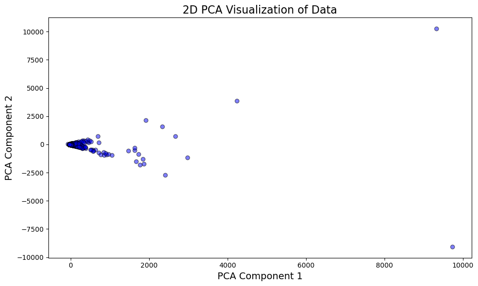
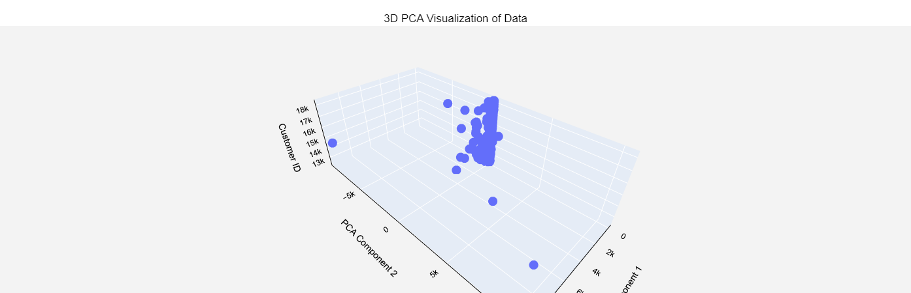
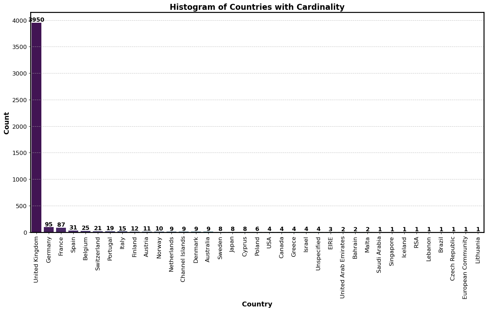
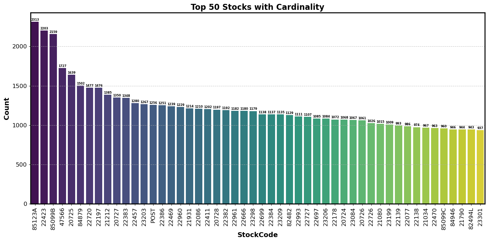
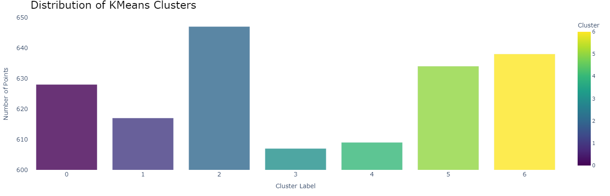
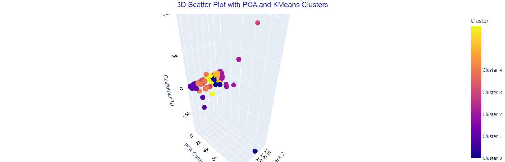

# ClusterCart-Unveiling-Customer-through-Data
---

## Introduction

In this project, we aim to segment customers based on their purchasing behavior using the **K-Means clustering algorithm**. Customer segmentation is an essential strategy for businesses, enabling them to gain deeper insights into their customer base, identify distinct groups, and tailor marketing and sales strategies accordingly. By uncovering patterns within customer data, businesses can improve product recommendations, enhance customer satisfaction, and ultimately increase profitability.

The methodology for this project is as follows:
1. **Data Analysis:** Pandas was used for data cleaning, preprocessing, and exploratory analysis to ensure the dataset was ready for clustering.
2. **Clustering Algorithm:** The **K-Means** algorithm was implemented to group customers into meaningful clusters based on behavioral and demographic similarities.
3. **Dimensionality Reduction:** **Principal Component Analysis (PCA)** was applied to reduce the data's dimensionality, simplifying visualization while preserving essential information.
4. **Visualization:** Interactive visualizations using **Plotly** allowed us to effectively analyze the clusters and present the results in an easily understandable format.

The goal of this project was to identify customer segments with similar characteristics, allowing businesses to target these groups with tailored marketing campaigns, optimize product offerings, and enhance customer retention strategies. Through the combination of K-Means clustering, data analysis, and visualization, this project demonstrates the power of data-driven customer segmentation in modern business strategies.

## About the Dataset

The dataset used in this project is the **Online Retail** dataset, which is publicly available on the **UCI Machine Learning Repository**. It contains transactional data from a UK-based e-commerce business, providing a comprehensive record of customer purchases. This data offers valuable insights into customer purchasing behavior, making it ideal for customer segmentation tasks. 

For further details, you can access the dataset on the [UCI Machine Learning Repository](https://archive.ics.uci.edu/dataset/352/online+retail).

## Exploratory Data Analysis

### Figure 01.Visualization of dataset by reduceding to 2 Dimension

### Figure 02. Visualization of dataset by reduceding to 3 Dimension

### Figure 03. Distribution of number of customer from each Country

### Figure 04. Distribution of top 50 StockID

## Result from Clustering 

### Figure 05. Distribution of number of Customer in each KMeans Cluster

### Customer Segmentation Table: provides a compact and visually organized view of the cluster.
|Cluster|Number of Customers| Sample Customer IDs|
|-------|---------|---------------------------------------------------------|
| **0** |   628   | `14056.0, 14059.0, 14062.0, 14064.0, 14066.0, ........` |
| **1** |   617   | `17446.0, 17449.0, 17451.0, 17453.0, 17454.0, ........` |
| **2** |   647   | `12346.0, 12349.0, 12350.0, 12352.0, 12353.0, ........` |
| **3** |   607   | `15773.0, 15776.0, 15777.0, 15780.0, 15781.0, ........` |
| **4** |   609   | `16607.0, 16609.0, 16612.0, 16613.0, 16614.0, ........` |
| **5** |   634   | `13182.0, 13185.0, 13186.0, 13187.0, 13188.0, ........` |
| **6** |   638   | `14920.0, 14923.0, 14924.0, 14929.0, 14931.0, ........` |                                          |

### Figure 06. Plot of Customer ID coloured by Custer in 3 Dimension

### ---------------------------- **sales strategies** --------------------------------
The probabilities for each customer show the likelihood that they will buy a specific product, based on their purchasing behavior and the cluster they belong to. Higher probabilities mean a greater chance of purchase. By examining these probabilities, businesses can identify which products are likely to be bought by customers in each segment. This insight enables businesses to create **targeted marketing strategies**, offering personalized recommendations that are more relevant to each customer, ultimately enhancing engagement and increasing the chances of successful sales.

### Likelihood (Probability) of buying for Each Product by KMeans Cluster
| Cluster | li_10002 | li_10080 | li_10120 | li_10125 | li_10133 | li_10135 |   .................    |
|---------|----------|----------|----------|----------|----------|----------|------------------------|
|    0    | 0.139685 | 0.141657 | 0.137839 | 0.126015 | 0.210436 | 0.177199 |   .................    |
|    1    | 0.137232 | 0.151795 | 0.151451 | 0.143733 | 0.192380 | 0.143863 |   .................    |
|    2    | 0.229921 | 0.138599 | 0.139947 | 0.265539 | 0.099843 | 0.170536 |   .................    |
|    3    | 0.121622 | 0.141712 | 0.136979 | 0.113994 | 0.129293 | 0.119751 |   .................    |
|    4    | 0.127115 | 0.145695 | 0.151906 | 0.114521 | 0.137853 | 0.102529 |   .................    |
|    5    | 0.122714 | 0.136104 | 0.136744 | 0.121490 | 0.101894 | 0.165568 |   .................    |
|    6    | 0.121711 | 0.144439 | 0.145134 | 0.114709 | 0.128302 | 0.120555 |   .................    |

## Results and Conclusion
**K-Means clustering algorithm** was successfully applied to segment customers based on their purchasing behavior and demographic information. The model identified several distinct customer groups, with each cluster representing customers with similar purchasing patterns. By examining the mean probability for each product across different clusters, we were able to determine the likelihood of a customer purchasing specific items. Higher probabilities for certain products indicated that customers in those clusters were more likely to purchase them, providing actionable insights into customer preferences.

### Real-World Applications
1. **Targeted Marketing and Personalization:** Segmentation enables businesses to design tailored marketing campaigns for each customer group.
2. **Product Recommendations:** By analyzing customer clusters, businesses can recommend products based on shared preferences, increasing cross-sells and upsells.
3. **Customer Retention Strategies:** Segmentation helps identify high-value customers for exclusive offers and devise re-engagement tactics for low-frequency buyers.
4. **Inventory Management and Demand Forecasting:** Understanding customer purchasing patterns helps businesses optimize inventory levels, ensuring they meet demand without overstocking.

### Drawbacks and Future Work
1. **Limited Customer Data:**
   The current model relies heavily on **transaction history**, which may not fully capture the diversity of customer behaviors. Future work can involve incorporating **additional data sources** such as customer browsing behavior, or customer feedback to improve segmentation accuracy.

2. **Scalability Issues:**  
   For large datset, the current approach may face **computing challenges**, especially with one-hot encoding and clustering algorithms. Future improvements could focus on optimizing the model for large datasets using techniques like **distributed computing frameworks**.

3. **Static Clustering Models and Automation:**  
   Segments generated by above project are static and may not be able adapt to evolving customer behavior. **Implementing dynamic models** or **continuous learning approaches** could help in updating clusters on new data automatically.

---
# ----------------------------------------------------------------
### * If want to know more about this project there are python Notebook file, Project report paper and all other resources included in same repository.
### * Feel free to reach out, I'm open to engaging in meaningful conversations and exchanging ideas on these areas. I welcome the chance to explore new insights, collaborate on projects, and contribute to ongoing discussions in these fields.
